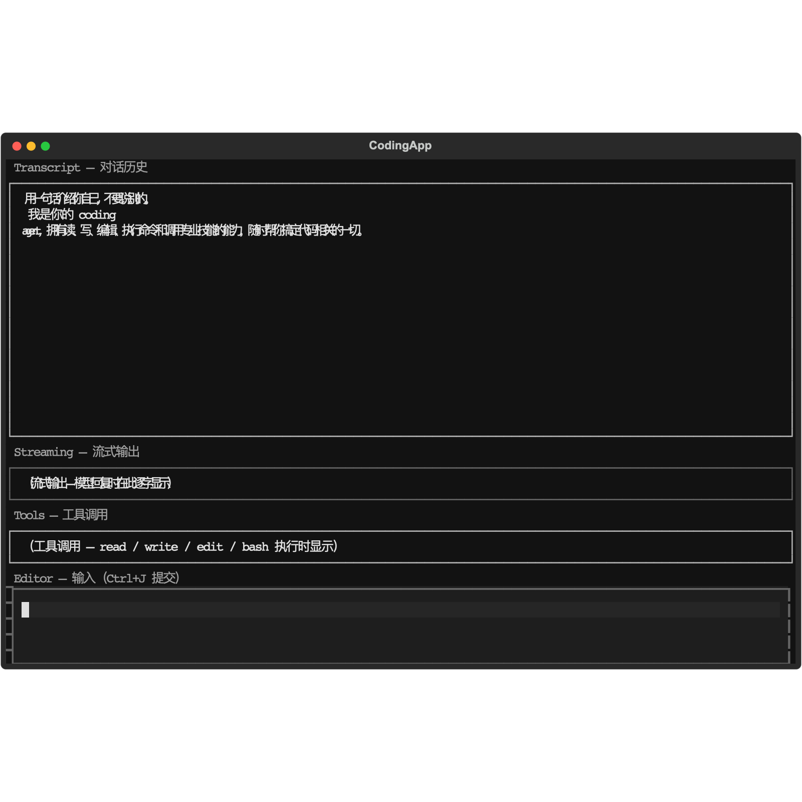

# pi-python

Python 实现对齐 [earendil-works/pi](https://github.com/earendil-works/pi) 的语义与扩展模型：薄 LLM 对接层、agent runtime、Textual TUI、可日常使用的交互式 coding CLI（`piy`）。

> 领域词汇与架构决策见 [`CONTEXT.md`](CONTEXT.md)。

## 要求

- Python **3.11+**
- [uv](https://docs.astral.sh/uv/)（推荐，本仓库用 uv workspace 管理 monorepo）

## 安装

### 从源码（推荐）

```bash
git clone https://github.com/maozhen520/pi-python.git
cd pi-python

# 可选：国内镜像加速（勿提交为默认；CI 使用官方 PyPI）
export UV_INDEX_URL=https://pypi.tuna.tsinghua.edu.cn/simple

uv sync --group dev
```

安装完成后，`piy` 命令通过 `uv run` 调用：

```bash
uv run piy
```

### 仅安装运行时（不含 dev 依赖）

```bash
uv sync
uv run piy --help
```

### 配置 API 密钥

凭证解析顺序：**环境变量优先**，其次 `~/.pi/agent/auth.json`。

```bash
# 方式一：环境变量（适合 CI / 一次性使用）
export OPENAI_API_KEY=sk-...

# 方式二：首次交互运行 piy 时会提示输入并写入 auth.json
uv run piy
```

**DeepSeek（OpenAI 兼容接口）示例** — 写入 `~/.pi/agent/auth.json`：

```json
{
  "OPENAI_API_KEY": "sk-你的密钥",
  "OPENAI_API_BASE": "https://api.deepseek.com/v1"
}
```

启动时指定模型：

```bash
uv run piy --approve --model openai/deepseek-v4-flash
```

默认模型为 `gpt-4o-mini`，可通过环境变量或 CLI 覆盖：

```bash
export PIY_MODEL=gpt-4o
uv run piy --model gpt-4o
```

`pi_llm` 基于 [LiteLLM](https://github.com/BerriAI/litellm)，理论上支持 LiteLLM 所支持的模型 ID（需配置对应 provider 密钥）。

## 使用

### 启动交互式 CLI

在项目目录下运行：

```bash
cd /path/to/your/project
uv run piy
```

首次进入未信任项目时，会询问是否加载项目侧 `.pi` 资源；非交互模式需显式批准：

```bash
uv run piy --approve          # 跳过信任询问，加载项目 .pi / .agents 资源
uv run piy --non-interactive  # 禁用 trust/auth 交互提示
```

### CLI 参数

| 参数 | 说明 |
|------|------|
| `--cwd PATH` | 项目工作目录（默认当前目录） |
| `--approve` | 不询问直接信任项目资源 |
| `--session PATH` | 从已有 JSONL 会话文件恢复 |
| `--model ID` | LiteLLM 模型 ID（默认 `gpt-4o-mini`） |
| `--non-interactive` | 禁用 trust / auth 交互提示 |

### TUI 操作

| 操作 | 说明 |
|------|------|
| `↵` / `Enter` | 提交底部编辑器中的输入 |
| `⇧↵` | 换行 |
| `Ctrl+J` | 提交（兼容快捷键） |
| `Ctrl+C` | 退出 |
| `/exit` 或 `/quit` | 退出 |
| `/compact [说明]` | 手动压缩上下文（写入 session JSONL） |
| `/模板名 参数...` | 展开 `prompts/` 下的提示模板 |

界面对齐上游 [pi](https://github.com/earendil-works/pi) 交互模式（自上而下）：

| 区域 | 说明 |
|------|------|
| **Header** | 品牌标识 |
| **Messages** | 统一消息流：user / pi 回复、流式输出、工具调用 |
| **Editor** | 多行输入框，`↵` 提交 |
| **Footer** | 当前模型、工作目录、快捷键提示 |



上图由 live E2E 脚本生成：真实 API 调用 → agent harness → TUI 渲染，一轮对话后自动截图。复现：

```bash
# 需已配置 ~/.pi/agent/auth.json（见上文 DeepSeek 示例）
uv run python scripts/e2e_live_tui.py
```

### 配置与资源目录

```text
~/.pi/agent/
  settings.json      # 全局设置（skills / prompts 路径等）
  auth.json          # API 密钥（可选，env 优先）
  trust.json         # 项目信任记录
  skills/            # 全局 Skills（SKILL.md 目录）
  prompts/           # 全局提示模板（*.md）
  sessions/          # 会话 JSONL（按 cwd 编码分子目录）

<project>/
  AGENTS.md          # 项目上下文（注入 system prompt）
  .pi/
    settings.json    # 项目设置（覆盖全局，需信任）
    skills/
    prompts/

~/.agents/skills/    # 共享 Skills（Agent Skills 布局）
<ancestor>/.agents/skills/  # 祖先目录 Skills
```

**项目信任**：加载 `.pi/` 与项目 `.agents/skills` 前需信任；`AGENTS.md` / `CLAUDE.md` 等上下文文件不受信任门控，始终注入。

### 恢复会话

会话默认保存在 `~/.pi/agent/sessions/<cwd-encoded>/`。恢复指定文件：

```bash
uv run piy --session ~/.pi/agent/sessions/<encoded>/<session-id>.jsonl
```

`list` / `branch` / `fork` 目前通过 Python SDK（`SessionStore`）提供，尚未暴露为 CLI 子命令。

### 作为 Python SDK 嵌入

```python
from pathlib import Path
from pi_agent import Agent
from pi_coding_agent.app import CodingSession
from pi_coding_agent.llm_bridge import make_stream_fn

session = CodingSession.create(
    cwd=Path("."),
    stream_fn=make_stream_fn(model="gpt-4o-mini"),
    approve_project=True,
)
await session.prompt("Read README.md and summarize it.")
```

四个包可独立 import：

| 包 | 用途 |
|----|------|
| `pi_llm` | LiteLLM 薄适配：流式补全、工具调用组装、凭证、错误映射 |
| `pi_agent` | 无状态 loop + 有状态 `Agent` SDK（`prompt` / `continue` / `steer` / `follow_up`） |
| `pi_tui` | 可复用 Textual 组件（transcript / streaming / tools / editor） |
| `pi_coding_agent` | 内置工具、资源发现、会话持久化、`piy` CLI |

## v1 能力清单

### 已实现

**LLM 层（`pi_llm`）**
- [x] LiteLLM `acompletion` 薄封装（OpenAI Chat Completions 路径）
- [x] 流式文本与工具调用增量事件
- [x] 工具参数组装完成后执行（assemble-then-execute）
- [x] 能力探测与 OpenAI 风格错误映射
- [x] 凭证：环境变量 → `~/.pi/agent/auth.json`

**Agent runtime（`pi_agent`）**
- [x] 纯 `agent_loop` + 有状态 `Agent` 双导出
- [x] `prompt` / `continue` / `steer` / `follow_up`
- [x] 按序 await 的 `subscribe` 事件屏障
- [x] 完整 agent/turn/message/tool 事件序列
- [x] AgentMessage vs LLM Message 投影（`transform_context` → `convert_to_llm`）
- [x] 工具 before/after hooks；parallel / sequential 批处理

**内置工具（`pi_coding_agent`）**
- [x] `read`：按行窗读取 + 截断
- [x] `write`：整文件写入
- [x] `edit`：精确多段替换（`edits[]` + 可选 `replace_all`），all-or-nothing，与 `write` 共享 per-file 队列
- [x] `bash`：session cwd、可选 timeout、输出截断（无内置沙箱）

**扩展与配置**
- [x] Skills 发现（`~/.pi/agent`、信任后 `.pi`、`.agents/skills`）
- [x] Prompt Templates（`prompts/*.md`，`/name` 展开）
- [x] Settings 嵌套合并（全局 + 项目）
- [x] 项目信任门控（`trust.json`）
- [x] 上下文文件（`AGENTS.md` / `CLAUDE.md` 祖先链 → `<project_context>`）

**会话与压缩**
- [x] 自有 JSONL 格式（`version` header + 消息树）
- [x] 创建 / 恢复 / 列表 / 分支 / 分叉（SDK）
- [x] 自动压缩（近窗口触发）+ 手动 `/compact`
- [x] 压缩后模型上下文 = summary + 近期尾部

**TUI 与 CLI**
- [x] Textual 四块 UI：transcript、streaming、tools、editor
- [x] Agent runtime 事件驱动 widget 更新
- [x] `piy` 交互式主路径（多轮、工具、会话续跑）
- [x] 交互式 auth 提示并保存；trust 询问 / `--approve`

**工程**
- [x] uv workspace 四包 monorepo
- [x] CI：ruff + ty + pytest（66 个测试，无需 live LLM）

### 未实现（v1 明确后置）

- [ ] Themes 与可发布 Packages 生态
- [ ] print / JSON / RPC 运行模式
- [ ] OAuth / 订阅登录 / OS keychain
- [ ] 内置权限沙箱（依赖宿主进程权限）
- [ ] 与上游 pi session 文件互读
- [ ] 上游 orchestrator / pi-chat
- [ ] 完整多厂商统一 API（仅 LiteLLM 聚合）
- [ ] 分支导航时的 branch summarization

## 开发

```bash
uv sync --group dev
uv run pytest
uv run ruff check .
uv run ty check

# 可选：live E2E（需 API 凭证，不走 CI）
uv run python scripts/e2e_live_tui.py
```

### 包结构

```text
packages/
  pi_llm/           # 薄 LiteLLM 适配
  pi_agent/         # Agent loop + Agent SDK
  pi_tui/           # Textual widgets / layouts
  pi_coding_agent/  # 内置工具、资源、会话、piy CLI
```

## 相关文档

- [`docs/architecture.md`](docs/architecture.md) — 四包关系、运行核心、扩展点与自定义工具
- [`CONTEXT.md`](CONTEXT.md) — 领域词汇表
- [`docs/agents/implementation-handoff.md`](docs/agents/implementation-handoff.md) — v1 实现交接
- [`docs/research/`](docs/research/) — 上游与 LiteLLM 调研笔记

## 许可证

见仓库根目录 LICENSE（如有）。
